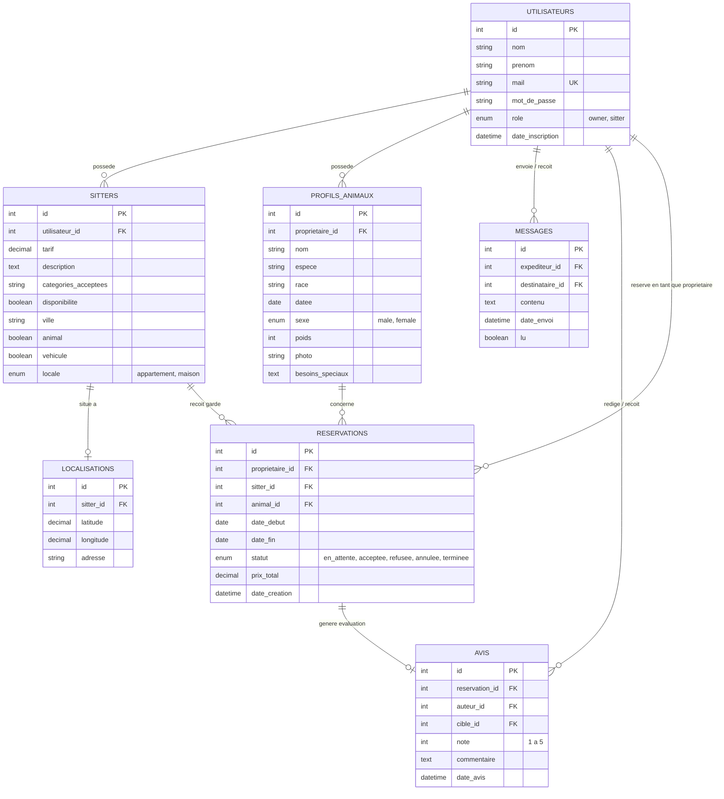
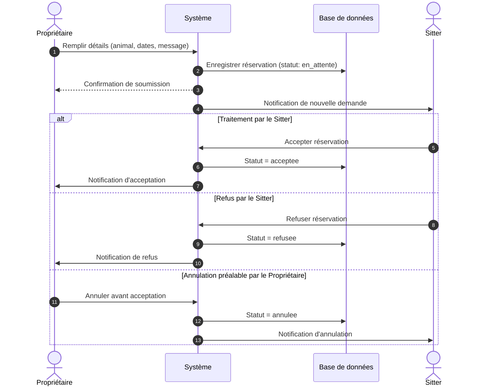

# 🐾 Pet'ini — Garde d'animaux entre voisins

> Plateforme collaborative de mise en relation directe entre propriétaires d'animaux de compagnie et gardiens (*pet sitters*) de proximité.

---

## 📌 Présentation du projet

Pet'ini répond au besoin des propriétaires d'animaux cherchant une solution de garde locale, humaine et abordable pendant leurs absences (vacances, déplacements, imprévus), tout en permettant aux passionnés d'animaux de proposer leurs services dans leur quartier.

Le projet comprend :
- Une interface web responsive aux teintes chaleureuses (HTML5, CSS3 modulaire, tokens de design).
- Un modèle relationnel complet (MySQL / MariaDB) avec gestion des rôles, réservations, animaux et messagerie.
- Une spécification UML modélisant les flux métiers clés (diagrammes de cas d'utilisation, de séquence et d'activité).

---

## 🚀 Fonctionnalités principales

1. **Gestion des comptes & rôles** : Inscription distincte pour propriétaires (`owner`), gardiens (`sitter`) ou profils mixtes avec contrôle d'accès.
2. **Fiches animaux détaillées** : Enregistrement de chaque animal (espèce, race, date de naissance, sexe, poids, description, besoins spécifiques et traitements).
3. **Recherche & géolocalisation de sitters** : Filtrage par ville, type de logement (appartement/maison), présence d'autres animaux, véhicule et coordonnées GPS (latitude/longitude).
4. **Cycle de réservation complet** :
   - Demande de réservation avec dates d'entrée/sortie et calcul automatique du tarif.
   - Machine à états : `en_attente` ➔ `acceptee` / `refusee` / `annulee` ➔ `terminee`.
5. **Messagerie interne & système d'avis** : Échanges directs entre membres et notation certifiée (1 à 5 étoiles + commentaire) liée à chaque réservation effectuée.

---

## 🏗️ Architecture des données (MySQL)

Le schéma relationnel est défini dans [`base_de_donnee.sql`](file:///Users/mac/Downloads/Pet-ini---Garde-d-animaux-entre-voisins-main/base_de_donnee.sql).

### Modèle Entité-Association (Mermaid)



---

## 📐 Spécifications et diagrammes UML

Le dossier [`Diagrams/`](file:///Users/mac/Downloads/Pet-ini---Garde-d-animaux-entre-voisins-main/Diagrams) documente la conception fonctionnelle (fichiers Draw.io) :

| Fichier | Type de diagramme | Objectif |
| :--- | :--- | :--- |
| `Diagramme_de_sequence_Pet'ini.drawio` | Séquence | Flux de demande de garde, annulation pré-acceptation, notification et validation sitter |
| `book a reservation.drawio` | Cas d'utilisation | Décomposition du cas d'usage « Réserver une garde » et inclusions techniques |
| `pet'ini activite diag.drawio` | Activité | Parcours utilisateur de la recherche à la confirmation / refus de réservation |
| `pet'ini general.drawio` | Cas d'utilisation global | Vision d'ensemble des interactions Propriétaire / Sitter / Système |

### Flux opérationnel de réservation



---

## 🎨 Système de design UI

L'interface repose sur un ensemble de variables CSS définies dans [`style.css`](file:///Users/mac/Downloads/Pet-ini---Garde-d-animaux-entre-voisins-main/style.css) :

- **Couleurs principales** : Crème (`#f5f0e8`), Vert nature (`#3a5a3c`), Marron terre (`#3d2b1f`), Rose doux (`#e8d5c4`).
- **Typographies** :
  - Titres : `Fredoka One` (affichage ludique).
  - Corps de texte : `Nunito` (lisibilité optimale).
  - Accents : `Caveat` (manuscrit convivial).
- **Responsive Design** : Grilles flexibles et media queries pour mobile, tablette et desktop.

---

## 📂 Structure du dépôt

```text
├── Diagrams/                             # Spécifications de conception logicielle (Draw.io)
│   ├── Diagramme_de_sequence_Pet'ini.drawio
│   ├── book a reservation.drawio
│   ├── pet'ini activite diag.drawio
│   └── pet'ini general.drawio
├── base_de_donnee.sql                    # Schéma DDL MySQL & données de test
├── index.html                            # Page d'accueil (Hero, mission, fonctionnalités, contact)
├── login.html                            # Écran de connexion sécurisé
├── signup.html                           # Écran d'inscription (sélection de rôle)
├── style.css                             # Feuille de styles globale et composants UI
├── pet'ini (1).pdf                       # Présentation du projet
└── README.md                             # Documentation technique
```

---

## 💻 Installation et démarrage local

### Prérequis
- Un serveur web local avec MySQL (XAMPP, WampServer, MAMP ou PHP CLI + MySQL).
- Un navigateur web moderne.

### 1. Cloner ou ouvrir le dossier
```bash
cd Pet-ini---Garde-d-animaux-entre-voisins-main
```

### 2. Importer la base de données
1. Ouvrez phpMyAdmin (`http://localhost/phpmyadmin`) ou votre client MySQL en ligne de commande.
2. Créez une nouvelle base de données :
   ```sql
   CREATE DATABASE petini CHARACTER SET utf8mb4 COLLATE utf8mb4_unicode_ci;
   ```
3. Importez le fichier [`base_de_donnee.sql`](file:///Users/mac/Downloads/Pet-ini---Garde-d-animaux-entre-voisins-main/base_de_donnee.sql) dans cette base.

### 3. Lancer l'application
- **Via un serveur local rapide (PHP)** :
  ```bash
  php -S localhost:8000
  ```
  Accédez ensuite à `http://localhost:8000` sur votre navigateur.
- **Via XAMPP / WampServer** :
  Placez le dossier dans `htdocs` (ou `www`) et rendez-vous sur `http://localhost/Pet-ini---Garde-d-animaux-entre-voisins-main`.


---

## 🔮 Feuille de route (Roadmap)

1. **Intégration d'API cartographique** : Remplacer l'aperçu statique par une carte interactive Leaflet.js / OpenStreetMap pour afficher les marqueurs des gardiens.
2. **API Backend REST (PHP PDO)** : Connecter les formulaires existants (`login.html`, `signup.html`, contact) avec des endpoints PHP préparés et sécurisés contre les injections SQL (`password_hash`).
3. **Module de paiement sécurisé** : Intégration d'un module de paiement séquestre (escrow) débloqué après confirmation de la garde.
4. **Téléversement de photos** : Stockage des photos d'animaux et galeries de gardiens avec compression d'images.
